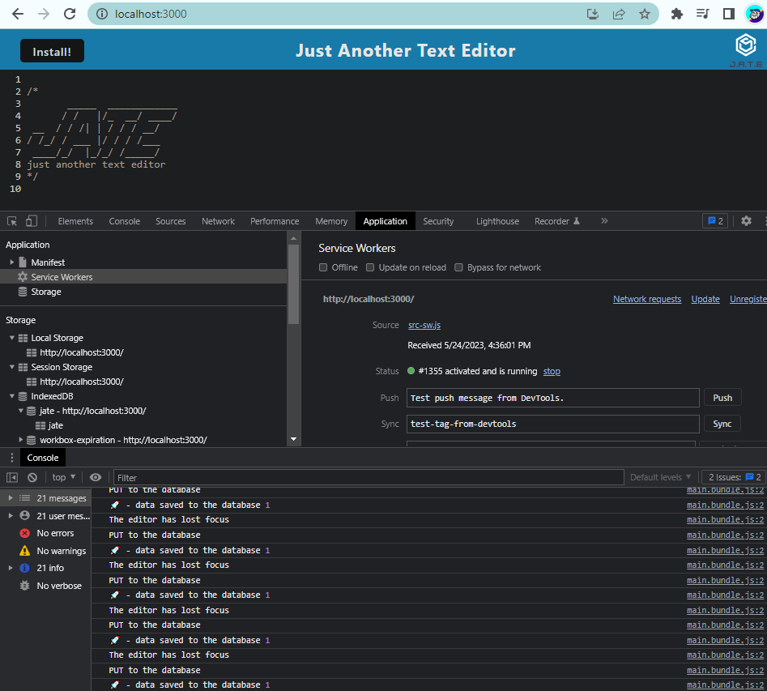
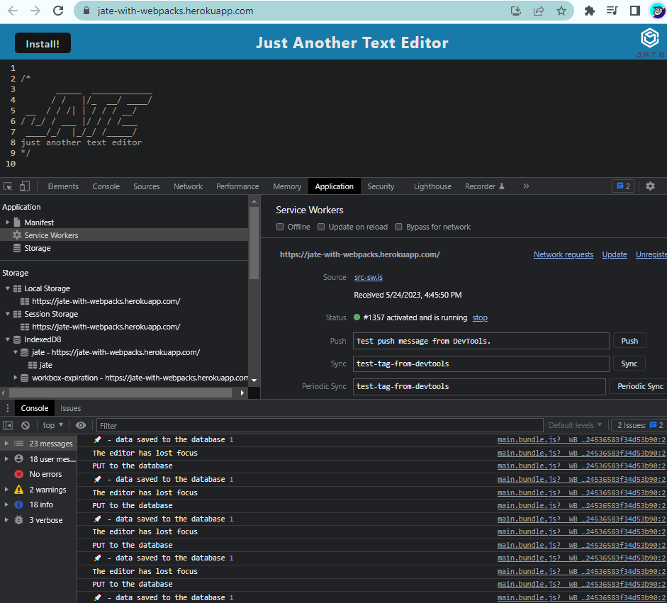

# Text Editor - JATE app  
  [Site on Heroku](https://jate-with-webpacks.herokuapp.com/)  
  A website application that has been bundled using [Webpacks](https://webpack.js.org) to demonstrate the different functionalities and structure when an application is packaged in this format. Built with the help of UofU Bootcamp TAs. The site saves the user's work when changing `focus`, and will store their work locally. The application can also be installed from the page (install methods may vary depending on your web browser).   
   
  

  ---
  ## Contents

  1. [Installation](#installation)
  2. [Usage](#usage)
  3. [License](#license)
  4. [Tests](#tests)
  5. [Contact](#contact)
  6. [Mock-Up](#mock-up)

  ---

  ## Installation:
  **Repo:** `git clone` 
  **Web App:** Select the `install` button on the top left of the screen of the live app. Note: some browers may have different install parameters, for example some Chrome users may need to use Chrom's install prompt in the brower's head.  

  ---

  ## Usage
  **Repo:** After cloning, enter in the command line `npm run build` to build out the package and structure, followed by `npm run start:dev` to run the site locally. 
  **Web App:** Appllication can be used within the broswer or downloaded to use as its own app. 
  

  ---

  ## License
   

  ---

  ## Tests:
  Either when running locally or on the live site, check the local storage to make sure the cached data updates correctly when the page is focused vs blured. In Chrome DevTools/Inspect, this would be under the "Applications" tab. 
  There will be `console.log()` entries to let you know when the site changes focus and saves data. 

  ---

  ## Contact Information:
  * GitHub Username: robotom01
  * Email: tmrtw8@gmail.com  

  ---

  ## Mock-Up:
  **Local** 
   
  **Live Site** 
   